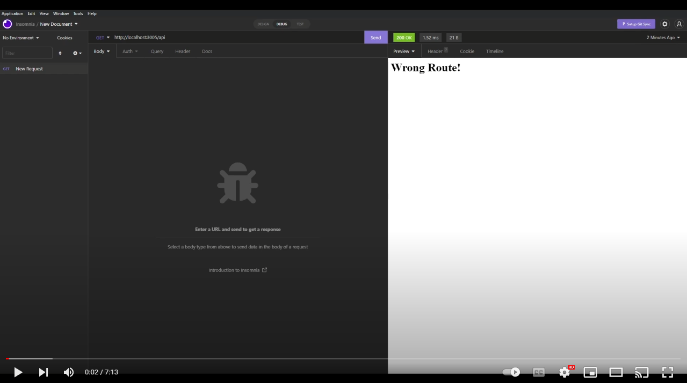

# E-Commerce Back End
This application allows you to interact with your database by providing a url-based API for hitting specific routes responsible for different types of requests.

**Here are some examples:**

## License
  
  
  
This application is distributed under the [MIT](https://opensource.org/licenses/MIT) license.
  ## Table of contents
  - [License](#License)
  - [About](#Usage)
  - [Contributions](#Contributions)
  - [Questions](#Questions)

  ## About
This application serves as a proof of concept for interacting with a back-end database using sequelize. This is not a deployed application but you can watch a demo of this app being used by clicking the video below:

  ## Contributors
  - William J. Horn
  ## Questions
  Find me on GitHub: <https://github.com/william-horn>
  
Reach me by email: williamjosephhorn@gmail.com

